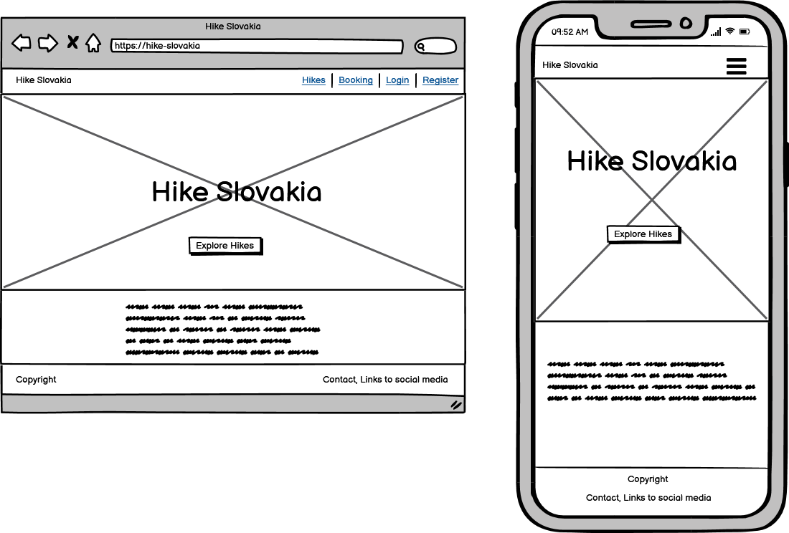
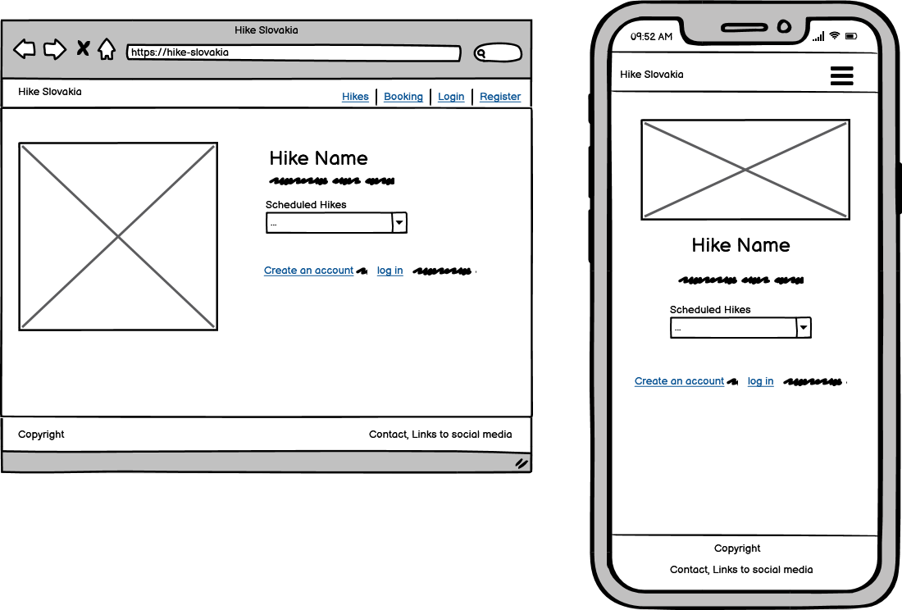
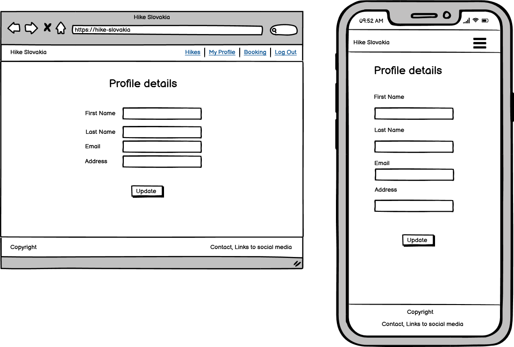
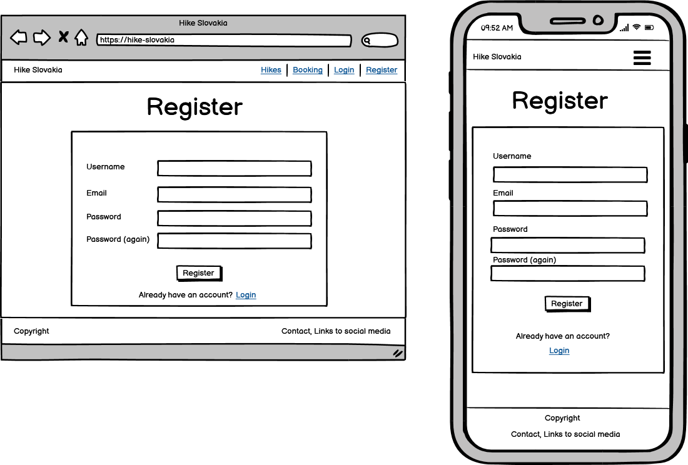
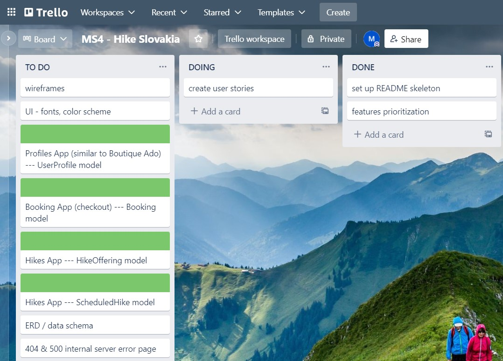

# Hike Slovakia
_“To walk in nature is to witness a thousand miracles.” - Mary Davis_

The app was built as my fourth milestone project for Diploma in Full Stack Software Development with Code Institute. 

Hike Slovakia is a multi-page eCommerce web application for both visitors of and people living in Slovakia who wish to explore the country and its beautiful hiking destinations. The website offers its users a chance to book onto guided hikes in the region.

You can view the live website [here]( "Hike Slovakia"). 

***
## User Experience (UX)

### Site Goals

#### Site Owner's Goals

* Letting people know about 'Hike Slovakia'.
* Motivating people to explore Slovakia and its hiking trails.
* Making profit from providing guiding services.
* Benefitting from an automated booking system. 
* Creating opportunity to scale the business.

#### Site User's Goals

* Exploring Slovakia using the services of an experienced guide.
* Finding information about all scheduled hikes, selecting & booking any with ease.
* Learning about hiking trails & destinations in Slovakia.

### User Stories

As a guest / not logged in user, I want to be able to:
* easily understand what the purpose of the website is.
* navigate the website easily, so that I can find any relevant content.
* find more information about the company, so that I can understand more about what they are doing.
* view an offering of all guided hikes posted on the website.
* find general details of any guided hike, as well as find out what dates they are scheduled on.
* start the booking process of the scheduled hike I am interested in.
* select the number of people I am booking the hike for.
* contact the business owner / administrator, so that I can ask any specific questions and get more information.
* view the website clearly on multiple devices, including my mobile device, so that I can achieve my other goals on the go.
* register on the website so that I can book / pay for a hike I am interested in.

As a registered / logged in user, in addition to the above, I want to be able to:
* log into my account so that I can use the website’s services.
* securely pay for the scheduled hike(s) I choose to book.
* receive a confirmation email after I successfully book my hike(s).
* log out.

As an admin, I want to be able to:
* add a new hike offering, so that I can expand my services offering.
* update and delete any existing hike offering, so that I can stay flexible in my offerings in accordance with my business needs.
* schedule a new hike.
* access the Django admin portal easily.

### Planned Features

* Navigation menu on all pages - changes contents depending on user status
* Home page with information on the site purpose
* User authentication (register, login, logout)
* List of guided hikes / hike offerings
* Guided hike detail page
* Hike booking / payment
* Admin interface
* 404 & 500 error pages
* Responsive design

### Wireframes

* Home page

* Hike Offerings page

* Hike Detail page

* Profile page

* Register page

* Login page

* 404 page

### Design

* #### Colour Scheme

* #### Typography

* #### Imagery

***
## Notes on Development Process

* Trello Board has been used since the beginning of development to track progress, capture ideas, and make notes (screenshot from early on in the process)

***
## Database Design

***
## Features

### Existing Features

### Features Left to Implement in the Future

***
## Technologies Used

### Languages Used

### Frameworks, Libraries & Programs Used

***
## Testing

### Validator Testing

### User Stories Testing

### Continuous Testing - Issues and Resolutions to issues found during testing

During the development process, the application was continuously tested and bugs and issues that were found were resolved. A few examples:

* When a user redirected to a checkout view manually (without selecting a hike to book first), a 500 internal server error was raised. This was happening due to the view initially incorrectly checking whether a local storage existed. (Which it did since we were initialising it there.) The bug was fixed by checking for existence of a hike_id in the local storage instead, and now if it does not exist, the user will be brought back to all_hikes view to select a hike to book.

* After implementing a confirmation email sending after a successful purchase, the checkout process started failing with 500 error. Logging details into console revealed a bug in code - customer's email was being populated with the user, rather than the user's email. The fix was rather straightforward and payment process works ok now. 

### Known Bugs and Issues

***
## Deployment

***
## Credits

### Code

* project is based on and developed from [Code Institute](https://codeinstitute.net/)'s walkthrough Boutique Ado
* code for modal from [W3Schools](https://www.w3schools.com/howto/howto_css_modals.asp)

### Content

### Media

* background immage on home page from [Pixabay](https://pixabay.com/)
* default hike image from [Pxhere](https://pxhere.com/)
* all other images of Slovak nature currently used on hikes pages were taken by Monika Hrda
* gif image used as a loading "spinner" found on [Icons8](https://icons8.com/preloaders/)

### Acknowledgements

A big thank you to fellow Slackers from Code Institute's Slack channel for their support, advice, encouragement, and friendship.